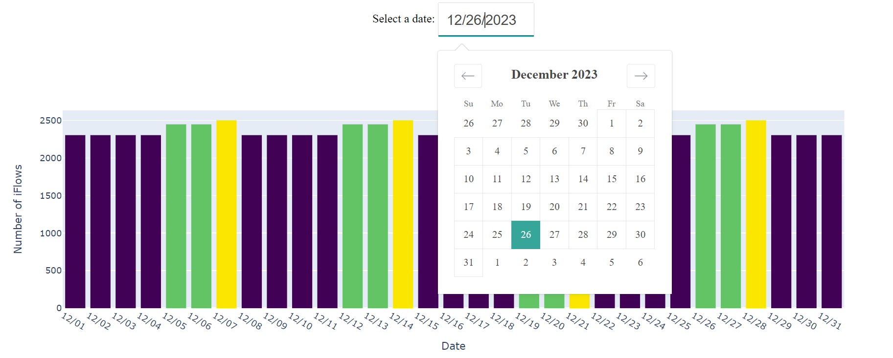
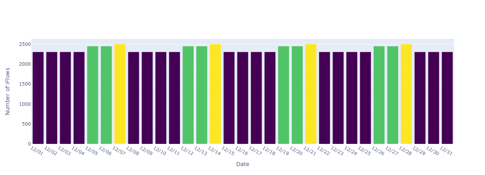
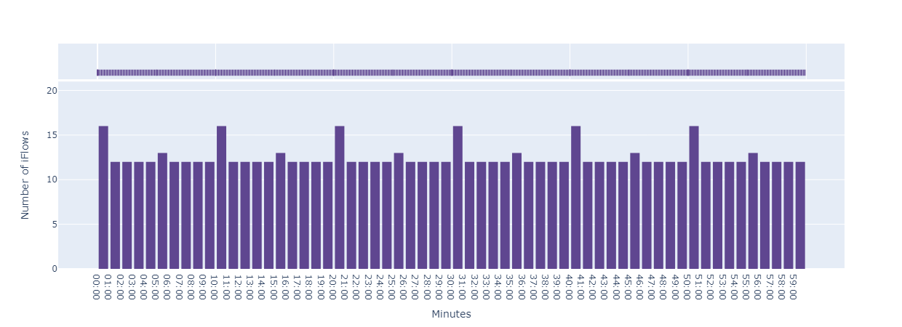

# Cron Schedualer

A tool visualize iFlow schedule with given date. 

**Credit**: Brady Holt (http://www.geekytidbits.com), Adam Schubert (https://www.salamek.cz)  
## Requirement
Filled config.json accordingly. Enviorment stated in requirement.txt
## Usage Example

```bash
python demo.py
```
Dash running on http://127.0.0.1:8050/
Select any day of the month you want to view. 

The 1st graph shows the number of iflow of the month. Hover to see number of iFlow on the given day.

Click on the bar of the day you want to view.
The 2nd graph shows the number of iflow of the day. Hover to see number of iFlow on the given hour.

Click on the bar of the time period (hourly) you want to view.
The 3rd graph shows the number of iflow of the hour. Fequency and number are shown. 

Click on the bar of certain time period (minute wise) will display the iFlow execute during this time and its fequency. 
Click export will export the .cvs file containing

```bash
{"id": [], "count": [], "description":[], "timestamp": []}
```
of every iFlow execute within the current hour.

## Cron Expression Test Example
Since this program highly relied on the interpertation of cron expression, here's an example of how cron descriptor work in our case.

```bash
# Consult Options.py/CasingTypeEnum.py/DescriptionTypeEnum.py for more info
from cron_descriptor import Options, CasingTypeEnum, DescriptionTypeEnum, ExpressionDescriptor,ExpressionSchedular
import datetime
from datetime import date
import json

EXPRESSION = "5-10 30-35 10-12 * * *"
descriptor = ExpressionDescriptor(
    expression = EXPRESSION,
    casing_type = CasingTypeEnum.Sentence,
    use_24hour_time_format = True
)
sched = ExpressionSchedular(EXPRESSION, qt = datetime.date(2023,10,26))
print(descriptor.get_description(DescriptionTypeEnum.FULL))
print([i.strftime("%H:%M:%S") for i in sched.get_schedule_timetable()])


```
## FYI
iflow_visuaizer_with_plotly.py using plotly
filow_visualizer.py using matplotlib


