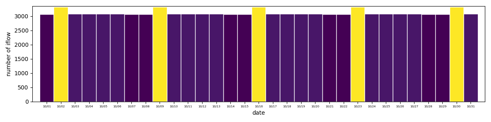
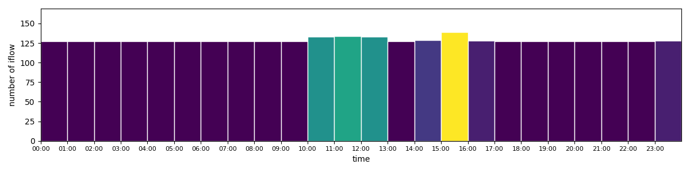
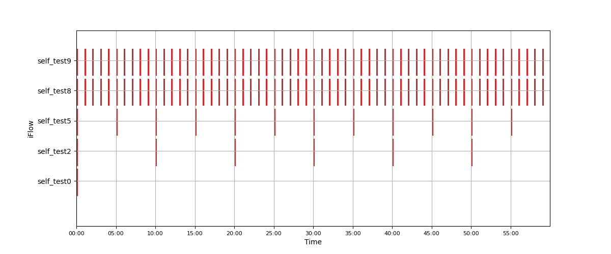

# Cron Schedualer


**Credit**: Brady Holt (http://www.geekytidbits.com), Adam Schubert (https://www.salamek.cz)  


## Usage example
```bash
usage: iflow_visualizer.py [-h] --visualize_type {hour,month,day} [--input_file_path INPUT_FILE_PATH]
                           [--output_file_path OUTPUT_FILE_PATH] [--year YEAR] [--month MONTH] [--day DAY]     
                           [--hour HOUR]
```

## Example
### Visualize By Month
```bash
python iflow_visualizer.py --visualize_type month --input_file_path 'test.json'  --month 10    
```


### Visualize By Day
```bash
python iflow_visualizer.py --visualize_type day --input_file_path 'test.json'  --month 10 --day 2 
```

### Visualize By Hour
```bash
python iflow_visualizer.py --visualize_type hour --input_file_path 'test.json'  --month 10 --day 2 --hour 15     
```



